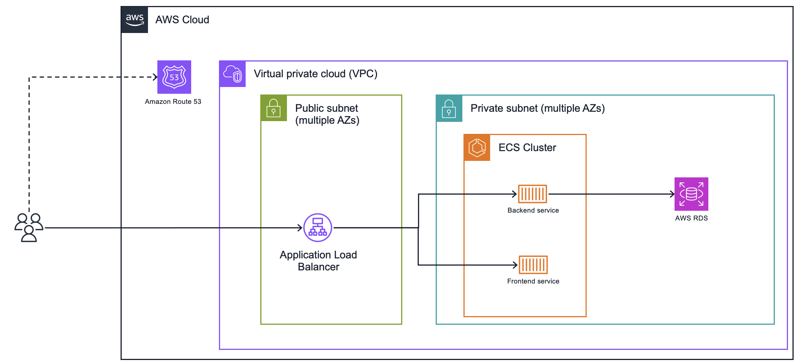

# Sample ECS application Stack

This sample ECS setup deploys two containers to an ECS cluster using the fargate capacity provider as well as a postgres database to the private networks of the VPC.
It'll allow the backend container to connect to the database using credentials stored in the secrets manager and makes it available through a frontend. All of the containers are hosted behind a internetfacing ApplicationLoadbalancer deployed in the public subnets.

## Architecture



## Deployment

```bash
# If not already initialized
npx cdk init

# deploy the stack
npx cdk deploy

# destroy the stack
npx cdk destroy
```
