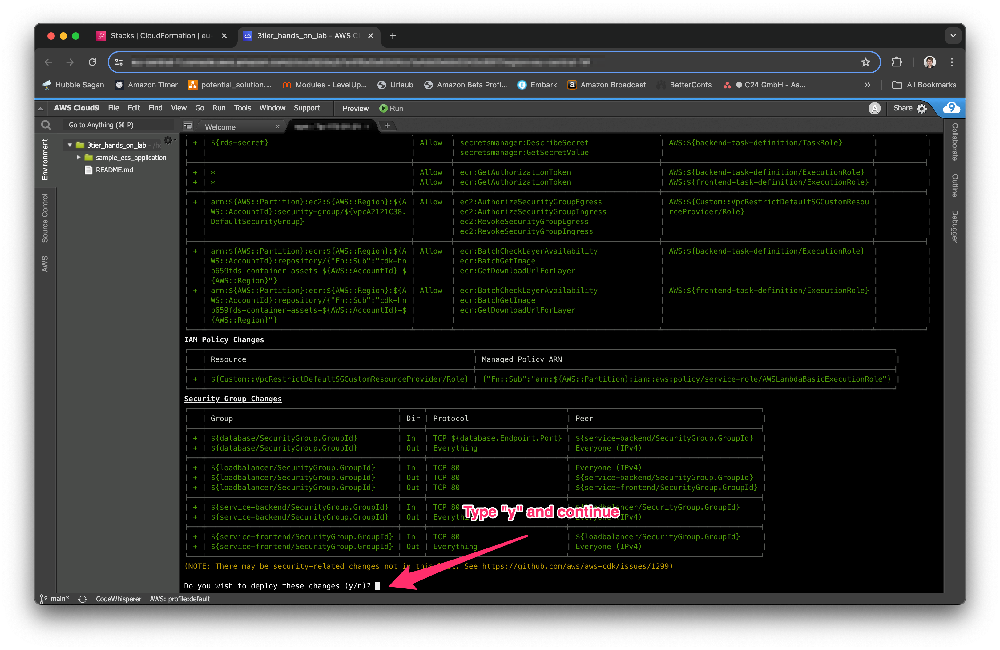

# Sample ECS application Stack

This sample ECS setup deploys two containers to an ECS cluster using the fargate capacity provider as well as a postgres database to the private networks of the VPC.
It'll allow the backend container to connect to the database using credentials stored in the secrets manager and makes it available through a frontend. All of the containers are hosted behind a internetfacing ApplicationLoadbalancer deployed in the public subnets.

## Architecture


## Structure

This repository contains everything needed to deploy the application.


### `/backend`

Contains the express backend application responsible for handling the API requests and connect to the database. The application is written in typescript using the [express](https://expressjs.com/) web framework.a

### `/frontend`

Represents the sample frontend layer and is a static web html webpage.

### `/lib`

Contains the AWS Cloud Development Kit (CDK) code and is the infrastructure as code part of the deployment by orchestrating the infrastructure and building the container assets required.

## Development using cloud9

This Chapter describes how to setup and develop this sample application using AWS Cloud9.

### Create Environment

Create a new AWS Cloud9 Environment by clicking the `Create Environment` Button


### Define new Environment

1. Select a rememberable name for your environment.
2. Leave `Environment type` at `New EC2 Instance`
3. Select `t3.small` as Instance Size
4. Scroll to the bottom of the page and hit `Save`


### Open AWS Cloud9

On the `Environments Overview page` hit the `open` link of your newly generate environment


### Welcome to AWS Cloud9

The IDE is split into the file pane on the left side, the editor on the right side and the terminal below it.


### Install `docker compose`

This sample application contains a `docker compose stack` we can use for development purposes. The AWS Cloud9 environment contains only `docker` but not `docker compose`. 
Lets install it

Lets start by downloading the `compose` plugin.

```bash
DOCKER_CONFIG=${DOCKER_CONFIG:-$HOME/.docker}
mkdir -p $DOCKER_CONFIG/cli-plugins
curl -SL https://github.com/docker/compose/releases/download/v2.27.0/docker-compose-linux-x86_64 -o $DOCKER_CONFIG/cli-plugins/docker-compose
```

Not we can make the plugin executable 

```bash
chmod +x $DOCKER_CONFIG/cli-plugins/docker-compose
```

Afterwards we can see the plugin version

```bash
docker compose version
```

### Clone and setup

```bash
git clone https://github.com/janwiemers/sample_ecs_application
cd  sample_ecs_application
npm install
```

### Starting the application

```
docker compose up
```

After the application has booted you can preview the application using the following steps.


## Local Development

This repository contains a `docker compose` stack that can be used for local development. This is a very typical setup for applications operated in containers.

The stack consists out of a database `db` service the `backend` as well as the `frontend` service. The Main entry point here will the the frontend service which is an [nginx](https://nginx.org/) used to host the static html content as well as acting as a [reverse proxy ](https://en.wikipedia.org/wiki/Reverse_proxy) to access the express backend. The configuration for nginx is places in the `/nginx` folder.

### Deployment through CDK

```bash
npm install
npx cdk deploy
```



You can check the deployment progress afterwards in the cloudformation console.


You can see the details of the stack by opening the stack details page.


### Starting

```sh
# Starting
$ docker compose up

# Starting in deamon mode
$ docker compose up -d

# tailing logs for a single container
$ docker compose logs {container name} -f

# cleanup
$ docker compose down
```

## Deployment

```bash
# If the CDK inside the account is not already bootstrapped
$ npx cdk bootstrap

# deploy the stack
$ npx cdk deploy

# destroy the stack
$ npx cdk destroy
```
